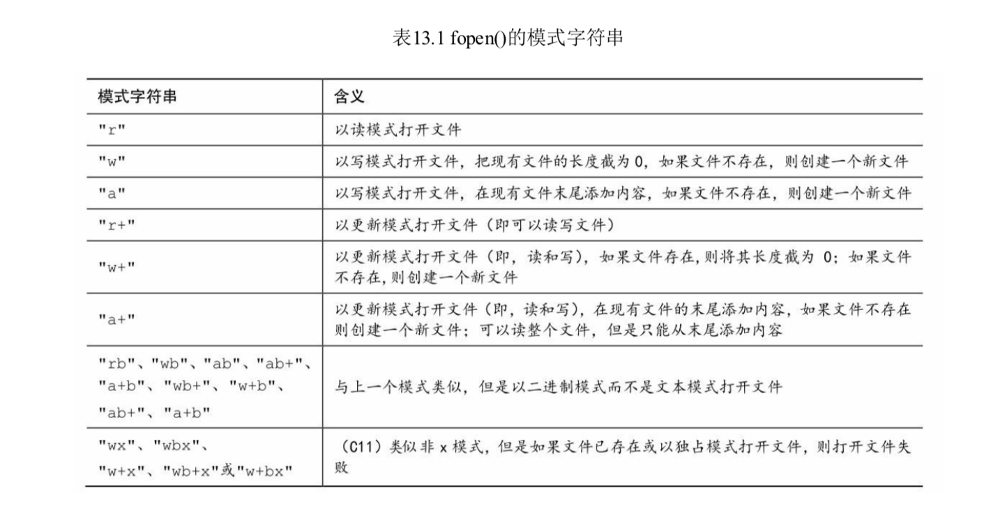
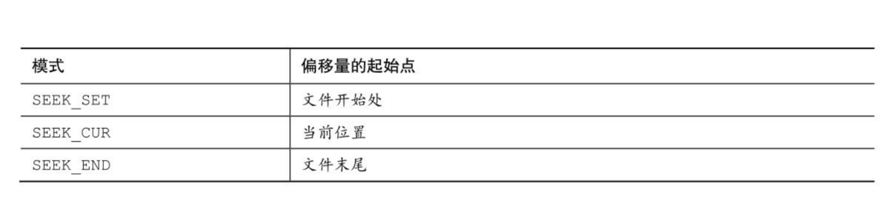

## 文件输入输出

本章主要内容：

函数：fopen(),getc(),putc(),exit(),fclose(),fprintf(),fscanf(),fget(),fput(),rewind(),fseek(),ftell(),fflush(),fgetpos(),fsetpos(),feof(),ferror(),ungetc(),setvbuf(),fread(),fwrite()

##### 文本模式和二进制模式

首先要区分文本内容和二进制内容、文本文件格式和二进制文件格式，以及文件的文本模式和二进制模式。

所有文件的内容都以二进制形式（0、1）存储。但是，如果文件最初使用二进制编码的字符（ASCII或者Unicode）表示文本，该文本是文本文件，其中包含文本内容。如果文件中的二进制代表机器语言代码或者数值数据，或图片或音乐编码，该文件是二进制文件，其中包含二进制内容。

```c
#include <stdio.h>
#include <stdlib.h>
int main(int argc, const char * argv[]) {
    
    int ch;
    FILE *fp;
    unsigned long count = 0;
    if (argc !=2 ) {
        printf("usage:%s filename\n",argv[0]);
        exit(EXIT_FAILURE);
    }
    if ((fp = fopen(argv[1], "r"))==NULL) {
        printf("Can't open %s\n",argv[1]);
        exit(EXIT_FAILURE);
    }
    while ((ch = getc(fp))!=EOF) {
        putc(ch, stdout);
        count++;
    }
    fclose(fp);
    printf("File %s has %lu character\n",argv[1],count);
    return 0;
}
```

这里 exit() 函数代表退出程序，EXIT_FAILURE代表退出失败，return和exit()一般情况下作用相同，但是如果main()在一个递归程序中时，exit()会退出所有程序而return只会退出把控制权交还上一级函数调用，相当于找到了函数出口。

##### fopen函数

```c
// 第一个参数表示带打开文件的路径
// 第二个参数表示打开文件的模式
FILE * fopen(const char * path, const char * mode);
```



对于UNIX和Linux这样只有一中文件类型的系统，带b字母的模式和不带b字母模式相同。

带x字母的写模式，有一些新特性。1、如果以传统写模式打开现有文件，fopen会把该文件长度截为0，丢失了文件内容。但是带x的字母的写模式即使fopen失败，源文件内容也不会被删除。2、如果环境允许，x模式的独占特性使其她程序或者线程无法访问症状打开的文件。相当于加了锁。

注意：任何一种w写模式打开一个现有文件，该文件内容都会被清除。

fopen返回值是一个FILE的结构指针，其她IO函数可以治愈这个指针制定该文件。结构指针并不是指向实际的文件，而是指向一个包含文件信息的结构，这里包含操作文件的IO函数所用的缓冲区信息。因为标准IO函数使用缓冲区，所以不仅需要知道缓冲区的为孩子，还要知道缓冲区被填充的程度以及操作哪一个文件，标准IO函数根据这些信息子必要的时候决定再次填充或者清空缓冲区。而结构指针包含了这些信息。

##### getc和putc函数

getc和putc函数和getchar和putchar类似，所不同的是getc和putc函数使用哪个文件。

```c
// 这表示从标准输入中获取一个字符
ch = getchar();
// 表示从fp指针指定的文件中获取一个字符
ch = getc(fp);
// 把字符ch放入FILE指针fpout指定的文件中
putc(ch,fpout);
```

把fp、fpout换成stdout标准输出、输入。功能getchar和putchar是一支的，实际上getchar和putchar就是使用fpout换成stdout来定义的。

当读取文件结尾时，返回EOF

```c
int ch;
FILE *fp;
fp = fopen("wack.tet","r");
ch = fget(fp);
while(ch != EOF){
  putchar(ch);
  ch = fget(fp);
}
```

##### fclose函数

fclose函数关闭fp指定文件，一般程序中应检查程序是否成功关闭，如果关闭成功返回0，否则返回EOF。

```c
if(fclose(fp) != 0) // 关闭文件错误
```

##### fprintf()和fscanf()函数

```c
void addaworld(const char *path)
{
    FILE *fp;
    char words[MAX];
    if ((fp=fopen(path, "a+")) == NULL) {
        fprintf(stdout, "Can't open file.\n");
        exit(EXIT_FAILURE);
    }
    puts("Enter world to add to the file;press the #");
    puts("key at the beginning of a line to terminate.");
    // 读取输入流中的数据存储到word中
    while ((fscanf(stdin, "%40s",words)==1) && (words[0] != '#')) {
        // 输出word到文件中
        fprintf(fp, "%s\n",words);
    }
    puts("File contents");
    rewind(fp);
	  // 读取fp中的数据到word中
    while (fscanf(fp, "%s",words) ==1) {
	      // 输入内容  
  	    puts(words);
    }
    puts("Done!");
    if (fclose(fp) != 0) {
        fprintf(stderr, "Error closing file\n");
    }
}

```

1、fprintf函数原型：**int** fprintf (**FILE******* stream, **const char\***format, [argument])

功能：fprintf()函数根据指定的格式(format)向输出流(stream)写入数据(argument)。

返回值：成功输出字符个数，错误返回负值

2、fscanf函数原型：int` `fscanf``(``FILE``*stream,const char*format,[argument...]);

功能：其功能为根据数据格式(format)从输入流(stream)中读入数据(存储到argument)；与[fgets](https://baike.baidu.com/item/fgets/10942211)的差别在于：fscanf遇到空格和换行时结束，注意空格时也结束，fgets遇到空格不结束。

返回值：整型，成功返回读入的参数的个数，失败返回EOF(-1)。

3、rewind函数原型：void rewind(FILE *stream); rewind函数作用等同于 (void)fseek(stream, 0L, SEEK_SET); 

功能：将文件内部的指针重新指向一个流的开头。

返回值：无

注意：不是[文件指针](https://baike.baidu.com/item/文件指针)而是文件内部的位置指针，随着对文件的读写文件的位置指针（指向当前读写字节）向后移动。而文件指针是指向整个文件，如果不重新赋值文件指针不会改变。

##### fgets()和fputs()函数

1、fget原型函数：char *fgets(char *buf, int bufsize, FILE *stream);

第一个参数表示存储输入位置的地址（char *类型）；第二个参数是一个整数，表示待输入字符串的大小，最后一个参数是文件指针，指定待读取的文件。

fget函数读取输入直到第一个换行符的后面，或者读取到文件结尾，或读取STLEN-1个字符。然后fget在末尾添加一个空字符使之成为一个字符串，这个字符串的大小是字符数加上一个空字符。如果fget在读取到字符上限前已经读完一整行，他会把表示结尾的换行符放在空字符前面，fget函数在遇到EOF时将返回NULL指针，可以使用这一机制检查文件是否到达文件结尾，如果在未遇到EOF，则之前返回传递给他的地址。

返回值：成功，则返回第一个参数buf；在读字符时遇到*end-of-file*，则eof指示器被设置，如果还没读入任何字符就遇到这种情况，则buf保持原来的内容，返回NULL；如果发生读入错误，error指示器被设置，返回NULL，buf的值可能被改变。

2、fputs原型函数：int fputs(const char *str, FILE *stream);

第一个参数是字符串的地址，第二个是文件指针，该函数根据传入的地址找到字符串写入文件中。和puts函数不同，fputs在打印字符串时不会在其末尾添加换行符。

返回值：该函数返回一个非负值，如果发生错误则返回 EOF(-1)。

##### 随机访问函数：fseek()和ftell()

有了fseek函数可以把文件看作是数组，在fopen打开文件中直接移动到了任意字节处。

```c
#define CNTL_Z '\032'// DOS文本结束标志
#define SLEN 81
void reverse(const char *path)
{
    char file[SLEN];
    char ch;
    FILE *fp;
    long count,last;
    puts("Enter the name of the file to be processed\n");
    scanf("%80s",file);
    if ((fp = fopen(path, "rb"))==NULL) {
        printf("reverse can't open %s\n",file);
        exit(EXIT_FAILURE);
    }
    fseek(fp, 0L, SEEK_END);
    last = ftell(fp);
    for (count = 1L; count<=last; count++) {
        fseek(fp, -count, SEEK_END);
        ch = getc(fp);
        if (ch!=CNTL_Z && ch != 'r') {
            putchar(ch);
        }
    }
    putchar('\n');
    fclose(fp);
}
```

fseek()函数原型：int fseek(FILE *stream, long offset, int fromwhere);

第一个参数是FILE指针，指向待查找的文件。第二个值是偏移量，该参数表示从起点开始移动的距离。该参数必须是一个long类型，也可为正（前移）、负（后移）、或者0（不动）。第三个参数是模式，设置偏移位置的起点。



注：可以使用0L、1L、2L分别表示上面三种模式。下面是一些使用示例：

```c
fseek(fp,0L,SEEK_SET);// 定位至文件开始处
fseek(fp,10L,SEEK_SET);// 定位至文件的第10个字节
fseek(fp,2L,SEEK_CUR);// 从文件当前位置前移两个字节
fseek(fp,0L,SEEK_END);// 定位至文件结尾
fseek(fp,-10L,SEEK_END);//从文件结尾回退10个字节
```

返回值：如果一切正常返回值为0；如果出现错误，返回值为-1；

fteel()函数返回值是long，返回当前的位置。

```c
void read_imageSize(const char *path)
{
    FILE *fp;
    if ((fp=fopen(path, "rb")) == NULL) {
        printf("打开照片流失败\n");
        exit(EXIT_FAILURE);
    }
    fseek(fp, 0L, SEEK_END);
    size_t size = ftell(fp);
    fclose(fp);
    printf("size:%lu\n",size/1024);
}
```

ftell()通过返回距离问价开始处的字节数来确定文件的位置，文件的第一个字节到文件开始处的距离是0，以此类推。另外C规定ftell()适用于以二进制模式打开的文件，以文件模式打开的情况不同。

##### fgetpos()函数和fsetpos()函数

函数原型: int fgetpos(FILE * restrict stream，fpos_t * restrict pos);

函数功能：在pos所指的位置放置一个fpos_t值，这个值描述了文件中的一个位置。fpos_t(file position type 文件定位类型)类型的变量或数据对象可以在文件中指定一个位置，不能是数组类型，可以是任何类型（比如是结构）。

返回值：如果成功，函数返回0；否则返回一个非零值。

##### 标准I/O的机理

1、标准I/O第一步调研fopen打开文件。fopen不仅打开文件，还创造一个缓冲区（读写模式下面创建两个缓冲区）以及一个包含文件和缓冲区数据的机构。fopen翻译指向该结构的指针，以便于其他函数知道如何找到该结构。

这个结构通常包含一个指定流中当前位置的文件位置指示器，还包含错误文件结尾指示器、指向缓冲区开始处的指针、文件标示和一个计数。

2、主要考虑文件输入，使用标准I/O的第2步是调用一个定义在stdio.h中的输入函数，fscanf、getc、fget等。一调用这些函数，文件中的数据块就被拷贝到缓冲区，缓冲区大小因实现而异，一般512字节或是他的倍数。最初调用函数，除了填充缓冲区外，还要设置fp所指向的结构中的值。尤其要设置流中当前位置和拷贝进缓冲区的字节数，当前位置通常从0字节开始。

在初始化结构和缓冲区后，输入函数按要求从缓冲区读取数据，在它读取数据时，文件位置指示器被设置为指向刚读取字符的下一个字符。由于stdin.h系列的所有输入函数都适用相同的缓冲区，所以调研任何一个函数都将从上一次函数停止调用的位置开始。

当输入函数发现已读完缓冲区中的所有字符，会请求把下一个缓冲区大小的数据块从文件中拷贝到该缓冲区。以这种方式输入函数可以读取文件中的所有内容直到文件结尾，函数在读取缓冲区中的最后一个字符后，吧结尾指示器设置为真，于是下一次被调用的输入函数将返回EOF。

输出函数以类似的方式吧数据写入缓冲区，缓冲区被填满时，数据将被拷贝至文件中。

##### 其他标准I/O函数

int ungetc(int c,FILE *fp)函数

原型函数：int ungetc(int c, FILE *stream);

- **c** -- 这是要被推入的字符。该字符以其对应的 int 值进行传递。
- **stream** -- 这是指向 FILE 对象的指针，该 FILE 对象标识了输入流。

功能：把字符 **c**（一个无符号字符）放回输入流中，如果把一个字符放回输入流，下次调用标准输入函数时将读取该字符。

返回值：如果成功，则返回被推入的字符，否则返回 EOF，且流 stream 保持不变。

```c
void ungetc_test(void)
{
    int ch;
    int result = 0;
    printf("Enter an integer:");
    // getchar读取缓冲区中的字符，调用getchar函数时，程序就等待用户按键，用户输入的字符被存储到键盘缓冲区，知道用户按回车为止，按下回车getchar才
    // 开始从stdio流中取入一个字符，返回值是读取的字符或者EOF。
    while ((ch = getchar()) != EOF && isdigit(ch)) {
        // ch-'0'：为了把ch转换为数字，实际上是两个ASCII码值相减
        // result*10保证几位数字乘几次10，保证最高位正确
        result = result*10+ch-'0';
        printf("char:%c,ch-'0':%d\n",ch,result);
    }
    // 最后一次读取到的是字符，把字符放入到输入流中
    if (ch != EOF) {
        // 标准输入流
        ungetc(ch, stdin);
    }
    printf("Number=%d\nNext character in stream=%c\n",result,ch);
}
```

int fflush()函数：

原型函数：int fflush(FILE *stream)

功 能: fflush函数引起输出缓冲区中所有的为写入数据被发送到fp指定的输出文件，这个过程称为刷新缓冲区。如果分配至空指针，所以输出缓冲区都被刷新，在输入流中使用fflush函数的效果是未定义的，只要最近一次操作不是输入操作，就可以使用该函数更新流。

返回值：刷新成功返回0，指定流没用缓冲区或者只读打开时也返回0，EOF返回表示错误。

int setvbuf()函数：

原型函数：*int setvbuf(FILE \*stream, char \*buf, int type, unsigned size);*

type：期望缓冲区的类型：

_IOFBF(满缓冲)：当缓冲区为空时，从流读入数据，或者缓冲区满时，向流写入数据。

_IOLBF(行缓冲)：每次从流中读入一行数据或向流中写入一行数据。

_IONBF(无缓冲)：直接从流中读入数据或直接向流中写入数据，而没有缓冲区

size：缓冲区内字节的数量、

函数功能：

int setvbuf()函数创建一个供标准I/O函数替换使用的缓冲区，在打开文件后切为对流行事其他操作之前，调用该函数。指针fp是被待处理的流，buf指向待使用的存储区，如果buf的值不是NULL，则必须创建一个缓冲区。

返回值：0表示成功，非0表示失败。

```c
void setvbuf_test()
{
    FILE *input,*outout;
    char bufr[512];
    input = fopen("file.in", "r+b");
    outout = fopen("file.out", "w");
    if (setvbuf(input, bufr, _IOFBF, 512) != 0) {
        printf("fail tp set buf for input file\n");
    }else{
        printf("buf set for input file\n");
    }
    if (setvbuf(outout, NULL, _IOLBF, 132) != 0) {
        printf("fail tp set buf for output file\n");
    }else{
        printf("buf set for output file\n");
    }
    fclose(input);
    fclose(outout);
}
```

##### 示例程序

参看函数demo。