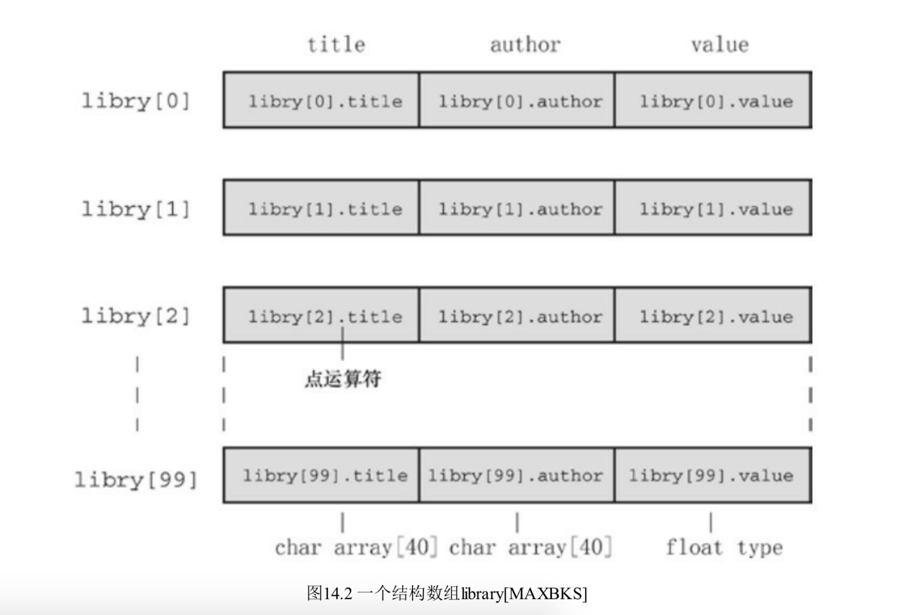

## 结构和其他数据形式

本章主要内容：

关键字：struct、union、typedef

运算符：.、->

##### 代码示例

```c
#include <stdio.h>
#include <string.h>
#define MAXTITLE 41
#define MAXAUTL 31
struct book {
    char title[MAXTITLE];
    char author[MAXAUTL];
    float value;
};
char *str_gets(char *st,int n);
int main(int argc, const char * argv[]) {
    struct book library;
    printf("Please enter the book title.\n");
    str_gets(library.title, MAXTITLE);
    printf("Now enter thr author.\n");
    str_gets(library.author, MAXAUTL);
    printf("Now enter thr value.\n");
    scanf("%f",&library.value);
    printf("%s by %s:$%.2f\n",library.title,library.author,library.value);
    printf("Done!\n");
    return 0;
}
char *str_gets(char *st,int n)
{
    char *ret_val;
    char *find;
    ret_val = fgets(st, n, stdin);
    if (ret_val) {
        // 查找‘\n’在st字符串中c首次出现的位置，找到返回st中相同字符的指针
        // 找不到返回NULL
        find = strchr(st, '\n');
        if (find) {
            // 找到讲换行符替换为结束符
            *find = '\0';
        }
    }else{
        while (getchar() != '\n') {
            continue;
        }
    }
    return ret_val;
}

```

##### 建立结构声明

上面代码声明建立了一个由两个字符数组和float类型变量组成的结构。首先由关键字struct表明后面跟的是一个结构，然后跟一个可选标记book，这个标记可以用来引用该结构。

```c
struct book library;
```

上面代码吧library声明为一个使用book结构布局的结构变量。

结构声明中使用花括号内包括结构成员列表，每个成员都使用自己的什么来描述。成员可以是任何C的数据类型，甚至可以是结构。

```c
struct book dickens
```

以上又声明一个book布局的结构变量。struct book 可以看作是一个新类型

结构有两层含义：

```c
struct book {
    char title[MAXTITLE];
    char author[MAXAUTL];
    float value;
};
```

以上代码只是结构布局，这是告诉编译器如何表示数据，但是并不分配空间。

```c
struct book library;
```

***这一步才是创建结构变量。编译器使用book结构布局模版为library变量分配空间，包含两个数组和一个float类型。占用空间大小。***

```c
sizeof(char)*MAXTITLE+sizeof(char)*MAXAUTL+sizeof(float)
```

##### 结构初始化

```c
struct book dicnew = {
        "newbooks",
        "author",
        10.0
    };
```

以逗号分隔，对应结构成员类型赋值即可。

##### 访问结构成员

访问结构元素使用点(.)。例如访问结构元素value的时候需要使用:library.value,library.title

##### 结构初始化器

可以指定初始化，例如下面代码：

```c
// 只初始化部分元素
    struct book suprise = {.value = 10.99};
    // 任意顺序初始化
    struct book gift = {
        .value = 10.99,
        .author = "James broadfool",
        .title = "Rue for road"
    };
    // 对特定成员对最后一次赋值才是实际的值
    struct book test = {
        .value = 10.99,
        .author = "dhzo",
        23.0
    };
```

##### 结构数组

```c
#define MAXBKS 100
void manybooks(void)
{
    struct book library[MAXBKS];
    int count = 0;
    int index;
    printf("Press enter at the start of a line to stop.\n");
    while (count<MAXBKS && str_gets(library[count].title, MAXTITLE) != NULL && library[count].title[0]!='\0') {
        printf("Now enter the author.\n");
        str_gets(library[count].author, MAXAUTL);
        printf("Now enter the value.\n");
        scanf("%f",&library[count++].value);
        while (getchar()!='\n') {
            continue;
        }
        if (count<MAXBKS) {
            printf("Enter the next title\n");
        }
    }
    if (count>0) {
        printf("Here is the list of your books:\n");
        for (index = 0; index< count; index++) {
            printf("%sby %s:$%.2f\n",library[index].title,library[index].author,library[index].value);
        }
    }else{
        printf("No books?Too bad.\n");
    }
}
```

声明结构数组和其他数组一样，只需要把struct book看作类型即可。

```c
// 声明一个包含10个元素的 struct book 类型数组，数组内元素为 struct book 类型结构。
struct book library[10]
```

这里需要注意，library不是结构名，它是一个数组名字。该数组中的元素都是struct book 类型的结构变量。如图所示：



##### 指向结构的指针

```c
#define LEN 20
struct names {
    char frist[LEN];
    char last[LEN];
};
struct guy {
    struct names handle;
    char favfood[LEN];
    char job[LEN];
    float income;
};
struct guy frllow[2] = {
      {
          {"Ewen","Villard"},
          "grilled salmon",
          "persionality caoch",
          6812.00
      },
      {
          {"Ewen","Villard"},
          "grilled salmon",
          "persionality caoch",
          6812.00
      },
  };
```

```c
// 申明一个指向结构的指针
struct guy *him;
// 告诉编译器该指针指向何处
him = &him[0]
```

声明结构指针很简单，上面 struct guy *him;就是指向结构的指针。

该声明并未创建任何新的结构，但是指针him可以指向任何现有类型的结构。例如barney是一个guy类型结构，可以写成him = &barney；

注意结构名并不是结构地址，因此需要在结构名上添加&运算符。上面例子fellow是一个结构数组，可以使用him = &fellow[0]，当然这里使用him++后指向fellow[1],

使用指针访问结构成员和结构名称访问使用点(.)不一样，指针访问使用->访问。

例如：him = &fellow[0],那么him->income,即fellow[0].income等价。

##### 向函数传递结构信息

1、直接传递结构成员

2、传递结构地址

3、传递结构

##### 其他结构特性

C现在允许吧一个结构赋值给另一个结构，但是数组不允许。例如n_data和o_data都是相同类型的结构，允许

```c
// 把一个结构赋值给另一个结构
n_data = o_data
```

上面的运用语句把o_data的每个成员都赋值给n_data打相应成员，即使是数组也能完成赋值。另外还可以把一个结构初始化为同类型的另一个结构

```c
struct nmaes right_field = {"Ruthie","George"};
struct nmaes captain = right_field;
```

##### 结构中字符数组和字符指针

到目前为止，在结构中都使用字符数组来存储字符串，是否可以使用指向char的指针来代替字符 数组。

```c
struct panames{
      char *frist;
      char *last;
  }
struct panames treas = {"brad","Falliingjaw"};
```

以上代码没问题，但是这里的字符串被存储到何处呢？

对于结构中使用字符数组存储字符串到情况，字符都存储到结构中，结构需要为字符串分配空间。然而 struct panames 中的存储在编译器存储常量的地方，结构中只存储了两个地址，结构不用为字符串分配存储空间。简单来说struct panames中的指针应该只用来在程序中管理哪些已分配和在别处分配的字符串。

```c
struct namecs accountant;
struct panames attorney;
puts("Enter the last name of your accountant\n");
scanf("%s",accountant.last);
puts("Enter the last name of your attorney\n");
scanf("%s",attorney.last);//这里会有问题。
```

因为scanf()会把字符串存储到attorney.last表示的地址上，而这是未经初始化的变量，因此可能是任何地址，所以如果要用结构存储字符串，用字符数组而不要用指向char的指针，会导致严重的问题。（结构会为成员分配空间，数组字符串会分配足够空间在结构中，指针字符串只会分配地址在结构中，而这个地址很肯能是未定义的）

##### 结构、指针、malloc

使用malloc()分配内存并使用指针指向该地址，此时使用指针处理字符串就比较合理。

```c
struct namect{
      char *frist;
      char *last;
      int letters;
  }
```

##### 使用结构数组的函数


