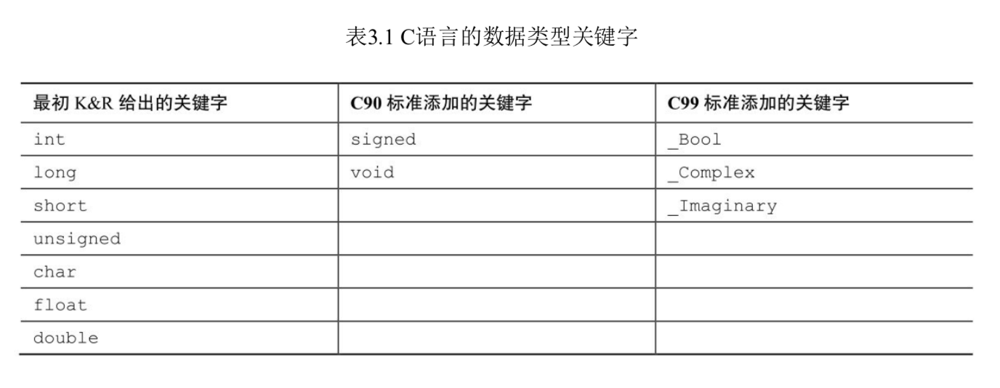
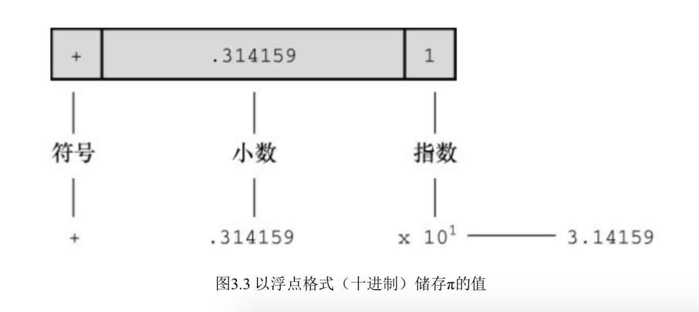

## 数据和C

本章主要内容：

关键字：int, short,long,unsigned,char,float,double,_Bool,_Complex,_Imaginary.

运算符：scanf(),整数类型和浮点类型区别，如何使用printf()和scanf()函数读写不同类型的值。

```c
//
//  main.c
//  数据和C
//
//  Created by 赵俊明 on 2019/5/5.
//  Copyright © 2019 赵俊明. All rights reserved.
//

#include <stdio.h>

int main(int argc, const char * argv[]) {
    float weight;// 你的体重
    float value;// 相等重量白金价格
    printf("Are you worth your weight in platinum?\n");
    printf("Let's check it out.\n");
    printf("Please enter your weight in pounds:");
    scanf("%f",&weight);
    value=1700.0*weight*14.5833;
    printf("Your weight in platinum is worth $%.2f.\n",value);
    printf("You are easily worth that! If platinum price drop,\n");
    printf("eat more to maintain your value.\n");
    return 0;
}
```

##### 代码解释：

scanf()函数：用于读取键盘的输入，%f说明scanf()要读取用户从键盘输入的浮点数，&weight告诉scanf()把输入的赋值给名为weight的变量。scanf()函数使用&符号找到weight变量的地址。

有些数据类型在程序使用之前已经预先设定好了，在整个程序运行期间没有变化，这些成为常量（constant），其他数据类型在运行期间可能会被改变或赋值，这些成为变量（variable）。

C语言数据类型关键字



int关键字表示基本的整数类型，long、short、unsigned和signed用于提供基本整数类型的变式，例如：unsigned short int和long long int。

char关键字用于指定字母和其他字符（如：%，*，¥）。另外char类型也可以表示较小的整数。

float，double和long double表示带小数点的数

_Bool类型表示布尔值

_complex和 _Imaginary表示负数和虚数

通过这些关键字创建的类型，按计算机存储方式可以分为两大基本类型：整数类型和浮点数类型。

##### 位、字节和字

位、字节和字是表述计算机数据单元或存储单元的术语，最小的存储单元是位（bit），可以存储0或1.位是计算机内存的基本构建块。

字节（byte）是常用的计算机存储单位，几乎对所有的机器，1字节（byte）均为8位。这是字节标准定义。既然1位可以表示0或1，那么8位就可以表示2^8种可能的0、1组合，最大为11111111，最小00000000，十进制表示为0～255.

字（word）是设计计算机时给定的自然存储单位，对于8位的微型计算机，1个字长8位。以后有16位，32位，64位，计算机字长越大，数据转移越快，允许访问内存更多。

##### 整数

和数学中概念一样，C语言中整数是没有小数部分的数，计算机中以二进制数字存储整数。例如：7在计算机8位字节中存储表示位：00000111

##### 浮点数：

浮点数和数学中的定义一样，这里要讲的是浮点数和整数的存储方案不同。计算机把浮点数分成小数部分和指数部分来表示，而且分开存储这两部分。因此7.00和7在数值上相同，但是存储方式不同。7.0可以写成0.7E1，这里0.7是小数部分，1指整数部分。下面演示了一个存储浮点数的例子：



### C语言基本数据类型

##### int类型

int类型是有符号整型，即int类型的值必须是整数，可以为正整数、负整数和0.取值范围根据计算机系统有差异，一般而言存储一个int要占用一个机器字长，因此早期IBM PC兼容机使用16位（两个字节）存储一个int值，取值范围是-32768～32768（-2^31~2^31-1，首位表示符号，0被划定为正数）。目前个人计算机一般32位（四个字节），即用32位存储一个int值，64位（八个字节）则能表示更大的数。

##### 打印int值

使用printf()函数打印int类型的值，%d指明了在一行中打印整数的 位置。%d称为转换说明，指定了printf()函数应该用什么格式显示一个值，格式化字符串中的每个%d都与待打印变量列表中相应的int值匹配。这个值可以是int类型变量，int类型常量，或其任何值为int类型的表达式。

##### 八进制和十六进制

通常C语言整形都是十进制，然而很多人喜欢使用八进制和十六进制。因为十六进制的每一位的数巧合都有4为二进制表示，这种对应关系使得十六进制和二进制转换很方便，在计算机中十六进制数前需要0x或0X，如十进制16十六进制表示为0x10，0表示8进制。

打印八进制整数使用%o，十六进制使用%x，另外要显示个进制数前缀0，0x，0X，需要使用%#o,%#x,%#X。

##### 整数溢出

```
// 测试整数溢出情况
void testFunc(void)
{
    int i = 2147483647;
    unsigned int j = 4294967295;
    printf("%d %d %d\n",i,i+1,i+2);
    printf("%u %u %u\n",j,j+1,j+2);
}
输出：
2147483647 -2147483648 -2147483647
4294967295 0 1
```

可以把无符号整数j看着汽车里程表，达到所能表示的最大值时，会重新从七点开始。整数i也是如此，只不过int开始是负值，而unsigned int是0。溢出行为是位定义行为，C标准并未定义有符号整型的溢出规则，因此也有可能出现其他情况。

**注释**：Mac Pro64位计算机中int用4位32字节表示。因此范围 **-2^32~2^31-1 (-2147483648~2147483647)**，unsigned int 范围**0～2^32 (0~4294967296)**。因此会导致整数溢出。

##### 打印short，long，long long和unsign类型

unsiged int  -> %u，long  -> %ld，short  -> %h，以8、16进制打印long类型  -> %lo，%lx。添加转换符l可以以long打印。

##### 使用字符串：char

char类型用于存储字符（字母、符号），但是底层技术层面char式整数类型，因为char世纪存储的是整数而不是字符，计算机使用ASCII编码表示。例如整数65代表大写字母A，因此A实际上存储的是65.

本机上char占用内存为1字节（8位），因此char范围（0～2^8）存储标准ASCII码搓搓有余。C语言吧1字节定义为char类型占用的位（bit）数，因此无论16、32位系统，都可以使用char类型。

##### float、double、long double

