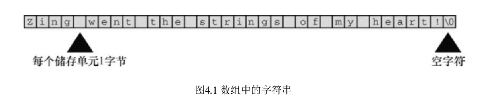
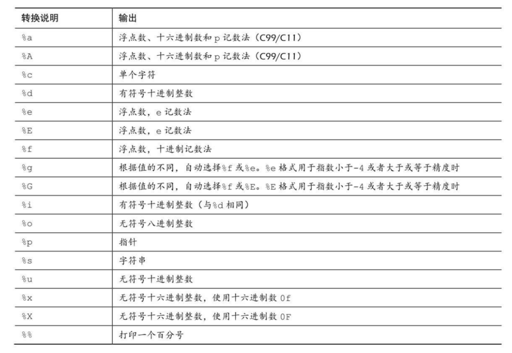
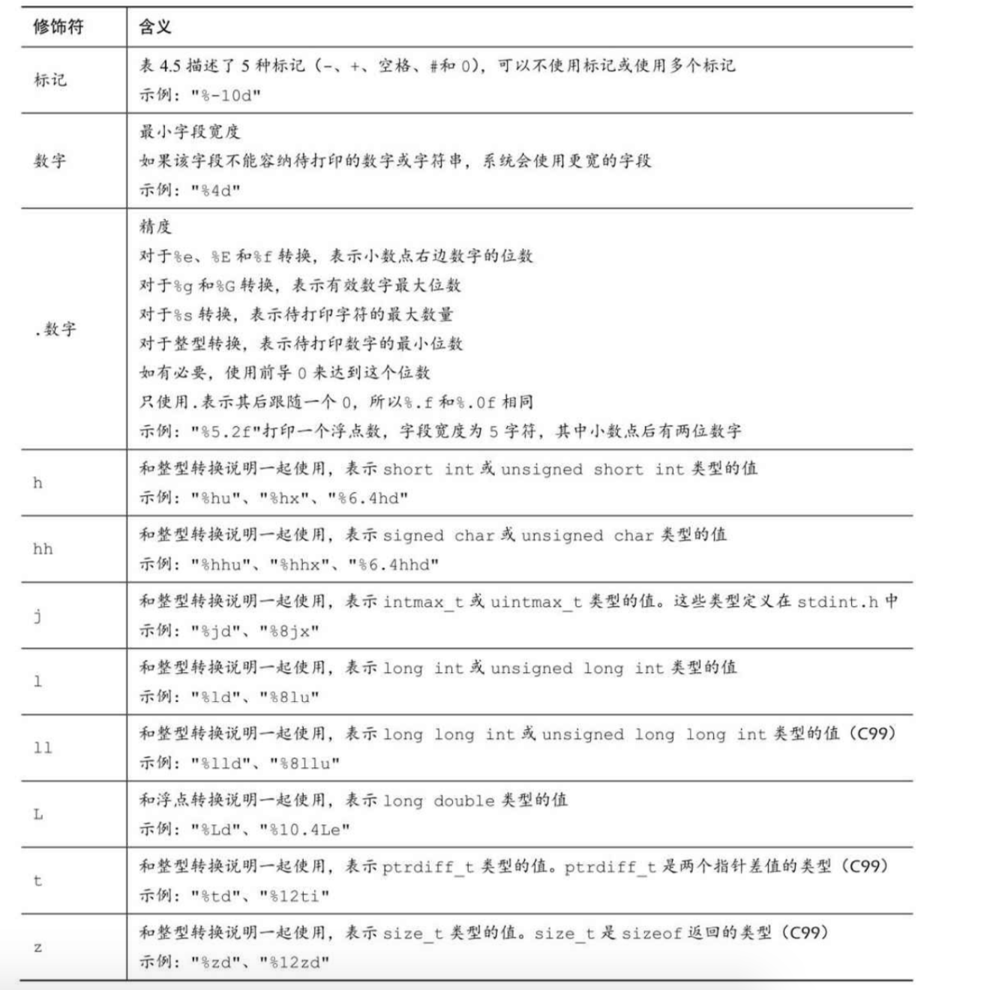
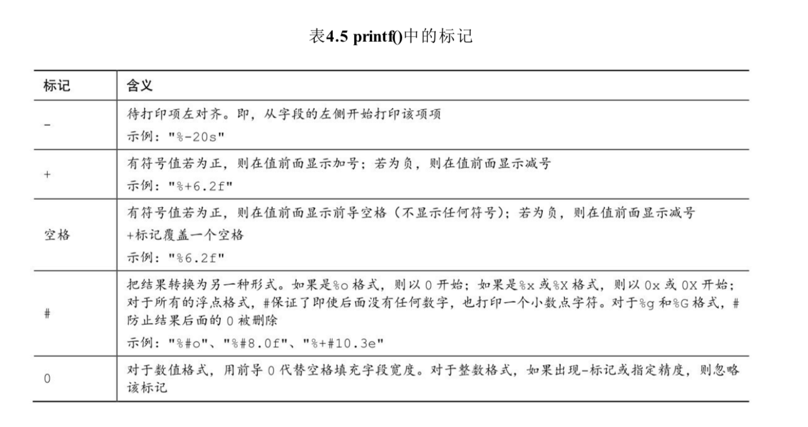
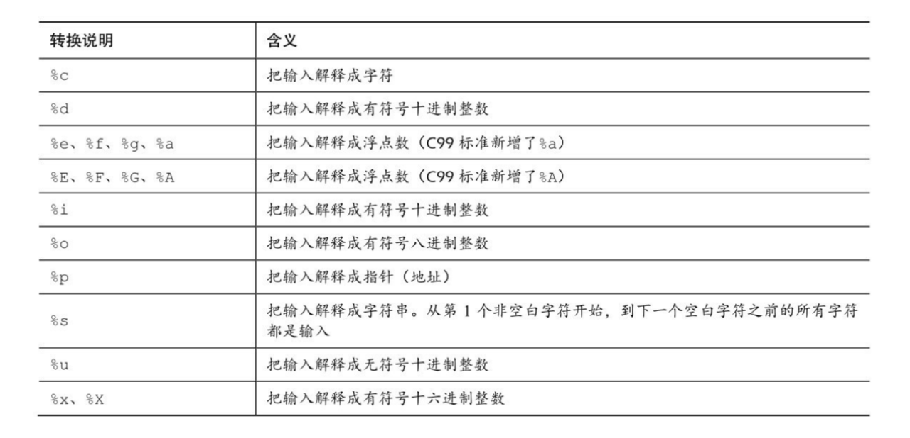
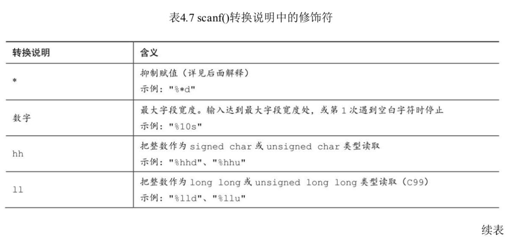
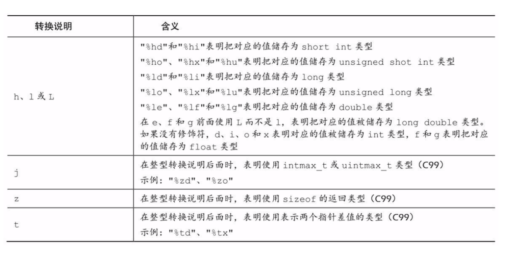

## 字符串和格式化输出

本章主要内容：

函数：strlen()

关键字：const

字符串：如何创建、存储字符串；如何使用strlen()函数获取字符串长度；使用C预处理指令#define和ANSIC的const修饰符创建符号常量

```c
//
//  main.c
//  4字符串和格式化输出
//
//  Created by 赵俊明 on 2019/5/6.
//  Copyright © 2019 赵俊明. All rights reserved.
//

#include <stdio.h>
#include <string.h>
#define DENSITY 62.4

int main(int argc, const char * argv[]) {
    float weight,volume;
    int size;
    size_t letters;
    char name[40];
    printf("Hi! What's you frist name?\n");
    scanf("%s",name);
    printf("%s,what's you weighr in pounds?\n",name);
    scanf("%f",&weight);
    size = sizeof(name);
    letters = strlen(name);
    volume = weight/DENSITY;
    printf("Well,%s,your volume is %2.2f cubic feet.\n",name,volume);
    printf("Also, your frist name has %zu letters,\n",letters);
    printf("and we have %d byte to store it.\n",size);
    return 0;
}
```

##### 代码解释：

程序使用数组（array）存储字符串（character string），用户输入的名字被存储到数组中，该数组占有内存中40个连续的字节，每个字节存储一个字符（char）。

使用%s转换说明处理字符串的输入和输出，注意在scanf()中name没有&符号，而weight却有。

##### 字符串简介

字符串（character string）是一个或者多个字符的序列。双引号不是字符串一部分，仅用来告诉编译器这是一个字符串，就像用单引号表示单个字符一样。

C中没有存储字符串的变量类型，字符串都被存储在char类型的数组中，数组有连续的存储单元组成，字符串被存储在相邻的存储单元中，每个单元存储一个字符。



注意数组末尾的字符\0，这是空字符（null character），C用它标记字符串的结束，空字符不是数字0，他说非打印字符，ASCII码是0。C中字符串一定以空字符结束，这意味着数组容量必须至少比待存储字符串中的字符数多1，因此程序中最多只能存储39个字符，剩下一个留给空字符。

##### 数组

数组可以看作是一行连续的多个存储单元，更正式的说法是，数组是同类型数据元素的有序序列。

```c
#define PRAISE "You are an extraordinary being."
void plains(void)
{
    char name[40];
    printf("what's you name?\n");
    scanf("%s",name);
    printf("Hello,%s,%s\n",name,PRAISE);
}

what's you name?
Angela Plains
Hello,Angela,You are an extraordinary being.
```

scanf()函数只读取了Angela Plains的Angela，它在遇到第一个空格时就不再读取输入，因此scanf()只读取了Angela。一般而言%s转换说明scanf()只会读取字符串中的第一个单词，而不是一整句，C语言中fgets()用于读取一般字符串。

```c
void strlength(void)
{
    char name[40] = "Hi! What's you frist name?";
    printf("len %zd-%zd\n",strlen(name),sizeof(name));
    printf("len %zd-%zd\n",strlen(PRAISE),sizeof(PRAISE));
}

len 26-40
len 31-32
```

strlen()得出的是字符串的个数（包括空格和标点符号，不包括结束符），sizeof()得出的结果更大，这是因为它把末尾不可见的空字符也计算在内。

##### const限定符

const关键字用于限定一个变量只读。const使用比#define灵活，因而程序中经常使用。

##### printf()和scanf()

printf()打印说明转换说明



scanf()把输入的字符串转换成整数、浮点数、字符或者字符串。而printf()正好相反，把整数、浮点数、字符和字符串转换成显示在屏幕上的文本。

scanf()和printf()类似，使用格式字符串和参数列表，scanf()中的歌手字符串表明字符串输入流的目标数据类型。scanf()读取基本变量类型的值，在变量前加上&，如果是字符串则不需要&。

##### 使用printf()

```c
#define PI 3.141593
void printout(void)
{
    int number = 7;
    float pies = 12.75;
    int cost = 7800;
    printf("The %d contestants ate %f berry pies.\n",number,pies);
    printf("The values of pi is %f.\n",PI);
    printf("Farewell!thou art too dear for my possessing,\n");
    printf("%c%d\n",'$',2*cost);
}

The 7 contestants ate 12.750000 berry pies.
The values of pi is 3.141593.
Farewell!thou art too dear for my possessing,
$15600
```

程序很简单，无论是值、变量、常量、还是表达式的值都可以使用printf()打印。这里只需要注意格式字符串中的转换说明一定要与后面的美国项相匹配，如果前后不一致，可能会导致问题。

另外如果打印特殊字符%，因为%符号用来标示转换说明，因此需要使用%%转译。

##### printf()的转换说明修饰符

在转换说明符%和转换字符之间是可以插入修饰符用来修饰基本的转换说明，下图是可以作为修饰符的合法字符。





示例程序

```c
#define PAGES 959
void testPrint1(void)
{
    printf("*%d*\n",PAGES);//1
    printf("*%2d*\n",PAGES);//2
    printf("*%10d*\n",PAGES);//3
    printf("*%-10d*\n",PAGES);//4
}

void testPrint2(void)
{
    const double RENT = 3852.99;
    printf("*%f*\n",RENT);//5
    printf("*%e*\n",RENT);//6
    printf("*%4.2f*\n",RENT);//7
    printf("*%3.1f*\n",RENT);//8
    printf("*%10.3f*\n",RENT);//9
    printf("*%10.3E*\n",RENT);//a
    printf("*%+4.2f*\n",RENT);//b
    printf("*%010.2f*\n",RENT);//c
}

*959*//1
*959*//2
*       959*//3
*959       *//4
*3852.990000*//5
*3.852990e+03*//6
*3852.99*//7
*3853.0*//8
*  3852.990*//9
* 3.853E+03*//a
*+3852.99*//b
*0003852.99*//c
```

代码1～2转换说明不带任何修饰符，对应输出结果与带整数字段宽度的转换说明的输出结果相同。表明待打印整数位数大于给定字段宽度的时候，字段宽度会自动扩大以符合整数的长度，小于字段宽度的时候使用0或者空格补齐（参见3、4、c行）。

第5行打印%f无设置任何字段宽度和小数点后位数，使用默认小数点后打印6位数字。注意第8行进行了四舍五入。

```c
void testPrint3(void)
{
    printf("%x*%X*%#x\n",31,31,31);//1
    printf("**%d**% d**% d**\n",31,31,-31);//2
    printf("**%5d**%5.3d**%05d**%05.3d**\n",6,6,6,6);//3
}

#define BLURB "Authentic imitation!"
void testPrint4(void)
{
    printf("[%2s]\n",BLURB);//4
    printf("[%24s]\n",BLURB);//5
    printf("[%24.5s]\n",BLURB);//6
    printf("[%-24.5s]\n",BLURB);//7
}

1f*1F*0x1f//1
**31** 31**-31**//2
**    6**  006**00006**  006**//3
[Authentic imitation!]//4
[    Authentic imitation!]//5
[                   Authe]//6
[Authe                   ]//7
```

第一行打印十六进制，添加#后打印出0x。第二行打印时添加了空格，但是当前面有负号的时候空格不显示，只有正数的时候前导空格才有效，这样可以对齐输出。第三行主要注意第3行当前面0标记和精度一起出现时，0标记会被忽略。

字符串打印同理，字段宽度小于字符串长度时，字段宽度自动扩展到字符串长度。精度可以截取对应位字符显示。

##### 转换说明的意义

转换说明的意义就是把以二进制格式存储在计算机中的值转换成一系列字符串以便显示。例如76在计算机内部存储为01001100.%d转换说明将其转换成字符7和6，%x把其转换为十六进制计数法4c，%c转换成字符L。

转换其实是翻译说明，给定转换说明符，就将给定值翻译成不同形式并打印出来。

##### 转换不匹配

```c
// 转换不匹配问题
#define WORDS 65618
void testPrint5(void)
{
    short num = PAGES;
    short mnum = -PAGES;
    printf("num as short and unsigned short:%hd*%hu\n",num,num);//1
    printf("-num as int and unsigned short:%d*%hu\n",mnum,mnum);//2
    printf("num as int and char:%d*%c\n",num,num);//3
    printf("WORDS as int short and char:%d*%hd*%c\n",WORDS,WORDS,WORDS);//4
}

num as short and unsigned short:336*336//1
-num as int and unsigned short:-336*65200//2
num as int and char:336*P//3
WORDS as int short and char:65618*82*R//4
```

上面的输出结果很有意思：第一行没问题，第二行输出65200，第三行输出P，第四行输出82和R都是有问题的，这是为什么呢？

%hu表示无符号整型，short占用两个字节，而系统使用二进制补码来表示有符号整数，这种方法数字0～32767代表本身，32760～65535表示负数，65535表示-1，65524表示-2，因此-336表示为65200，因此被解释成有符号int时65200代表-336，无符号int时，表示65200本身。

第三行，如果把一个大于255点值转换成字符时，在我们的系统中，short int是2字节，char是1字节。当打印336使用%c时，它只会查看存储336的2个字节的后一字节，这种截断相当于用一个数除以256，只保留玉树，这种情况下余数是80，对应ASCII字符是P，专业术语来说，该数字被解释成以256为模，即除以256后取余。

计算机补码，取模运算规则。

```c
void testPrint6(void)
{
    float n1 = 3.0;
    double n2 = 3.0;
    long n3 = 2000000000;
    long n4 = 1234567890;
    printf("%.1e %.1e %.1e %.1e\n",n1,n2,n3,n4);
    printf("%ld %ld\n",n3,n4);
    printf("%ld %ld %ld %ld\n",n1,n2,n3,n4);
}

3.0e+00 3.0e+00 0.0e+00 0.0e+00
2000000000 1234567890
2000000000 1234567890 5059768053515092142 77992
```

使用浮点数%e打印long类型，%e认为待打印数为double类型，系统中占用8字节（根据系统不同）long占用4字节，因此转换打印时不仅会查看long本身4个字节，还会查看n3相邻4字节，把8字节单元组成解释成浮点数，因此打印出来的结果肯定错误。

第四个打印来看即使有的用对了转换说明，结果也可能是错的，用%ld打印浮点数会失败，但是这里打印long类型也失败了，问题出在C如何把信息传递给函数，具体因编译器而已。函数printf("%ld %ld %ld %ld\n",n1,n2,n3,n4);调用时，程序吧传入的值放入栈(stack)中，然后根据变量类型把这些值放入栈中，因此n1、n2在栈中占8字节，n3、n4占用4字节。然后程序进行第二步取值，printf()函数根据转换说明依次取4个字节，因为转换说明为%ld，因此这里就变成了先取n1的前半部分，再取n1的后半部分被解释成了前两个值，接着取出n2的前半部分和后半部分解释成后两个值。完全用错了字节，而且真实的n3、n4根本就没有用，所有肯定不对。

##### 使用scanf()

scanf()做的事情和printf()相反，把键盘生成的文本字符转换为对应的类型。例如根据转换说明将输入字符转换为整数、浮点数、字符、字符串。printf()函数参数使用变量、常量、表达式，而scanf()函数参数使用指向变量的指针。

注意⚠️：如果使用scanf()转换基本变量类型的值，需要加&，如果是字符串加入字符串数组不需要加&。（后面讲字符数组和指针的关系）

```c
void testPrint7(void)
{
    int age;
    float assets;
    char pet[30];
    printf("Enter you age,assets,and favorite pet\n");
    scanf("%d %f",&age,&assets);
    scanf("%s",pet);
    printf("%d $%.2f %s\n",age,assets,pet);
}

Enter you age,assets,and favorite pet
20
30
zhao
20 $30.00 zhao
```

scanf()函数使用空白（换行符，制表符，空格）把输入分成多个字段，再一次把转换说明和字段匹配时跳过空白。上面代码输入是每行输入一个然后回车键分割，或者使用“20 30 zhao”使用空格分割也可以。

唯一例外的是%c转换说明，scanf()中%c会读取每一个字符，包括空格。稍后会讨论着部分。

scanf()函数使用转换说明和printf()几乎一样。区别在于float类型恶化double类型，printf()都使用%f、%e、%E、%g和%G转换说明。而scanf()只把以上用于float类型，对于double类型时要使用l修饰符。



转换说明中的修饰符





下面详细的讨论一下scanf()读取输入的流程。假设根据%d转换说明读取一个整数，scanf()函数每次读取一个字符，跳过所有空白符号，直至第一个非空字符才开始读取，因为要读取整数，所有发现一个数字字符或者一个符号(+，-)如果找到一个数字或者符号，便保存该字符，并读取下一个字符，如果下一个字符是数字，保存该数字读取下一个直至读取到非数字字符，此时认为读取到数字末尾。然后把非数字字符放回输入。这意味着下一次读取输入时，首先会读取上一次丢弃的非数字放回输入。最好scanf()会把已经读取的数字相应数值计算后的值放入制定变量。下面代码是测试程序

```c
void testPrint8(void)
{
    int input;
    char str[30];
    printf("please input numbers:\n");
    scanf("%d",&input);
    scanf("%s",str);
    printf("output is %d,str is %s\n",input,str);
}
输入1:
please input numbers:
-100abc
output is -100,str is abc

输入2:
please input numbers:
-100 100
output is -100,str is 100

输入3：
please input numbers:
a100
output is 32766,str is a100
```

这里只看输入3输出结果。因为第一个是字符a，scanf()会直接把a100返回输入，下一个scanf()会读取a100，这是第二个%s输出为a100正确的原因。如果程序使用了多个转换说明符，C规定在第一个出错处停止读取。

如果scanf()使用了位宽，如果输入的字符长度大于位宽，程序会在位宽长度字符处停止，如果小于则会在遇到第一个空格处停止。

```c
void testPrint9(void)
{
    float input;
    int number;
    printf("please input numbers:\n");
    scanf("%2f",&input);
    scanf("%2d",&number);
    printf("input is %f\n",input);
    printf("number is %d\n",number);
}
输入1：
please input numbers:
123456
input is 12.000000
number is 34

输入2：
please input numbers:
1234.12 898
input is 12.000000
number is 34
  
输入3：
please input numbers:
12 345
input is 12.000000
number is 34
```

可以看出scanf()不仅会根据位宽讲输入做截断，而且截断的值会给下一个scanf()使用（如果有的话）

如果读取字符串%s，基本规则和上面一样，只不过最后会在字符串末尾添加'\0'。

##### 格式字符串中的普通字符串

scanf()允许把普通字符放在格式字符串中，除了空格字符串外的普通字符必须于输入字符串严格匹配。

```c
void testPrint10(void)
{
    int number1;
    int number2;
    printf("please input numbers:\n");
    scanf("%d,-=%d",&number1,&number2);
    printf("number is %d--%d\n",number1,number2);
}

please input numbers:
33,-=24
number is 33--24

please input numbers:  
33,24
number is 33--0
```

##### printf()和scanf()的*修饰符

```c
void testPrint11(void)
{
    unsigned width,precision;
    int number = 256;
    double weight = 242.5;
    printf("Please enter width!\n");
    scanf("%d",&width);
    printf("The number is:%*d\n",width,number);
    printf("Now enter a width and aprecision:\n");
    scanf("%d %d",&width,&precision);
    printf("Weight=%*.*f\n",width,precision,weight);
}

Please enter width!
10
The number is:       256
Now enter a width and aprecision:
10 3
Weight=   242.500
```

输入的时候修饰符*提供占位功能，允许自定义输入位宽、精度等值，这些值由原来硬编码写变为自定义灵活提供精度、位宽等值。

scanf()中*的用法于此不同，把\*放在%和转换字符之间，会使得scanf()跳过想要的输出项。

```c
void testPrint12(void)
{
    int n;
    printf("Please enter three intger\n");
    scanf("%*d %*d %d",&n);
    printf("last number is %d\n",n);
}

Please enter three intger
123 48 98
last number is 98
```

以上代码很简单，前面两个%*d代表会跳过前两个输入，只读取最后一个输入。

##### scanf()返回值：

scanf()函数返回成功读取的项数，如果没有读取任何项且需要读取一个数字而用户却输入一个非数值字符串，返回0。当scanf()检测到文件结尾时，返回EOF（EOF值为-1）